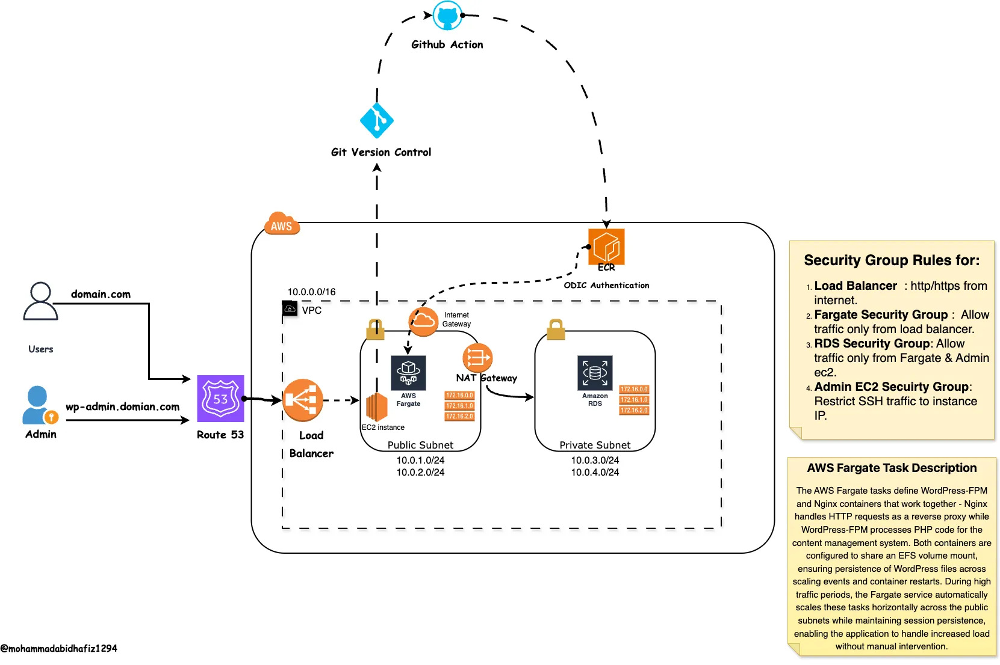

# WordPress CI/CD on AWS ECS

This project implements a containerized WordPress application deployed on AWS ECS Fargate with a complete CI/CD pipeline using GitHub Actions. The infrastructure is provisioned using Terraform and follows modern DevOps practices.

## Architecture Overview



The architecture consists of:

- **VPC (10.0.0.0/16)** - Isolated network environment
- **Load Balancer** - Routes traffic to ECS services
- **Public Subnets (10.0.1.0/24, 10.0.2.0/24)** - Houses Internet Gateway and ECS Fargate instances
- **Private Subnets (10.0.3.0/24, 10.0.4.0/24)** - Contains RDS database, protected from direct internet access
- **ECS Fargate** - Runs WordPress and Nginx containers
- **Amazon RDS** - Managed MySQL database for WordPress
- **ECR** - Container registry for WordPress images
- **OIDC Authentication** - Secure authentication for CI/CD pipeline
- **GitHub Actions** - Automated CI/CD pipeline

## Components

### 1. AWS Infrastructure
- **VPC & Networking**: Segregated public and private subnets
- **ECS Cluster**: Fargate-based containerized deployment
- **RDS**: Managed MySQL database
- **Load Balancer**: Routes traffic to containers
- **Security Groups**: Controls access to resources

### 2. CI/CD Pipeline
- **GitHub Actions**: Automated workflows for CI/CD
- **OIDC Authentication**: Secure AWS access
- **ECR**: Storage for Docker images
- **Git Version Control**: Source code management

### 3. Application
- **WordPress**: Content management system running on PHP-FPM
- **Nginx**: Web server as reverse proxy

## GitHub Actions Workflow

The project includes a CI/CD workflow that automatically builds and deploys WordPress changes to AWS ECS Fargate.

### How to Use the Workflow

1. **Set up required GitHub Secrets**:
   - `AWS_REGION`: Your AWS region (e.g., us-west-2)
   - `ECR_REPOSITORY`: Name of your ECR repository
   - `ECS_CLUSTER`: Name of your ECS cluster
   - `ECS_SERVICE`: Name of your ECS service
   - `ECS_TASK_DEFINITION`: Name of your ECS task definition
   - `AWS_ROLE_ARN`: ARN of the IAM role with permissions to deploy to ECS

2. **Configure OIDC Authentication**:
   - Follow the [AWS guide for OIDC configuration](https://docs.github.com/en/actions/deployment/security-hardening-your-deployments/configuring-openid-connect-in-amazon-web-services)
   - Create an IAM role with the following trusted policy:
   ```json
   {
     "Version": "2012-10-17",
     "Statement": [
       {
         "Effect": "Allow",
         "Principal": {
           "Federated": "arn:aws:iam::YOUR_ACCOUNT_ID:oidc-provider/token.actions.githubusercontent.com"
         },
         "Action": "sts:AssumeRoleWithWebIdentity",
         "Condition": {
           "StringEquals": {
             "token.actions.githubusercontent.com:aud": "sts.amazonaws.com"
           },
           "StringLike": {
             "token.actions.githubusercontent.com:sub": "repo:YOUR_GITHUB_USERNAME/YOUR_REPO_NAME:*"
           }
         }
       }
     ]
   }
   ```

3. **WordPress Code Structure**:
   - Place your WordPress code in the `wordpress/` directory
   - Store Docker configuration files in the `docker/wordpress-fpm/` directory

4. **Workflow Trigger**:
   - The workflow automatically runs when:
     - Changes are pushed to the `main` branch
     - Files are modified in the `wordpress/` or `docker/` directories
   - You can also manually trigger the workflow from the GitHub Actions tab

5. **Monitoring Deployments**:
   - Track deployment progress in the GitHub Actions tab
   - Check ECS console for task status
   - Verify your changes on the live WordPress site after deployment completes

### Security Considerations for the CI/CD Pipeline

- The workflow uses OIDC authentication instead of long-lived AWS access keys
- ECR images are tagged with both commit SHA and 'latest' for traceability
- The pipeline waits for service stability before completing
- Permissions follow the principle of least privilege

## Prerequisites

- AWS Account
- GitHub Account
- Terraform installed locally
- AWS CLI configured
- Docker installed locally

## Setup Instructions

### 1. Clone the Repository

```bash
git clone https://github.com/yourusername/ECS-project-for-Wordpress-CI-CD.git
cd ECS-project-for-Wordpress-CI-CD
```

### 2. Configure AWS Credentials

Create an IAM user with appropriate permissions and configure AWS CLI:

```bash
aws configure
```

### 3. Set up GitHub Repository Secrets

Add the following secrets to your GitHub repository:
- `AWS_REGION`
- `ECR_REPOSITORY`

### 4. Deploy Infrastructure with Terraform

```bash
cd terraform
terraform init
terraform plan
terraform apply
```

## CI/CD Workflow

The CI/CD pipeline follows these steps:

1. **Code Change**: Developer commits code to the GitHub repository
2. **GitHub Actions Trigger**: Automated workflow starts
3. **Build**: WordPress container is built with the latest code
4. **Test**: Automated tests run on the container
5. **Push to ECR**: Successful builds are pushed to ECR
6. **Deploy to ECS**: The ECS service is updated with the new container image

## Infrastructure Details

### ECS Configuration

The ECS cluster runs two containers:
1. **Nginx**: Handles HTTP requests and forwards to WordPress
2. **WordPress**: PHP-FPM implementation of WordPress

The containers share data through an EFS volume mount that persists WordPress files.

### Networking

- **Domain**: domain.com
- **Admin Access**: domian.com/admin
- **VPC CIDR**: 11.0.0.0/24
- **Public Subnets**: 11.0.1.0/24, 11.0.2.0/24
- **Private Subnets**: 11.0.3.0/24, 11.0.4.0/24

## Usage

### Accessing WordPress

After deployment, WordPress will be accessible via the Load Balancer URL:

```
http://[load-balancer-dns]/
```

### Administering WordPress

Access the WordPress admin panel at:

```
http://[load-balancer-dns]/wp-admin/
```

## Monitoring and Maintenance

- ECS Container Insights is enabled for monitoring
- CloudWatch logs capture container output
- Regular database backups are recommended

## Security Considerations

- OIDC authentication secures the CI/CD pipeline
- Private subnets protect database from direct access
- Security groups limit traffic to required ports only
- Secrets are managed through GitHub Secrets and AWS Secrets Manager

## Contributing

1. Fork the repository
2. Create a feature branch (`git checkout -b feature/amazing-feature`)
3. Commit changes (`git commit -m 'Add amazing feature'`)
4. Push to branch (`git push origin feature/amazing-feature`)
5. Open a Pull Request

## License

This project is licensed under the MIT License - see the LICENSE file for details.
